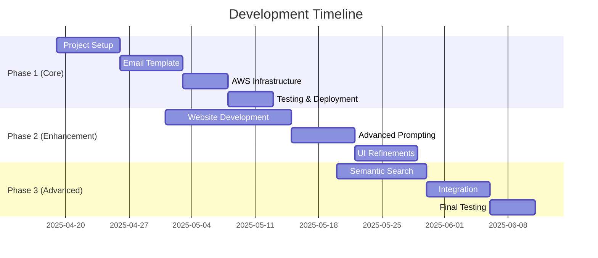

# HackerNews Bot Project Roadmap

## 📋 Project Overview

### Vision
Create an intelligent news digest system that curates and summarizes the best content from HackerNews, delivering valuable insights directly to users' inboxes while building a searchable knowledge base over time.

### Core Objectives
1. Automate the collection and summarization of top HackerNews articles
2. Deliver concise, valuable summaries via email
3. Maintain a searchable archive of past articles and summaries
4. Optimize for cost-effectiveness using GPT-4-mini

### Success Metrics
- Reliable 3-day delivery schedule
- High-quality, relevant summaries
- Minimal operating costs
- Scalable architecture

## 🎯 Core Features (Must-Haves)

### 1. Email System
- [ ] Design responsive HTML email template
  - Clean, modern aesthetic
  - Mobile-friendly layout
  - Readable typography
  - Article cards with summaries
- [ ] Email delivery system
  - AWS SES integration
  - Delivery tracking
  - Error handling
- [ ] Cross-client testing
  - Gmail, Outlook, Apple Mail
  - Mobile clients
  - Desktop clients

### 2. Automation System
- [ ] AWS EventBridge scheduler
  - 3-day interval triggers
  - Timezone handling
  - Failure recovery
- [ ] Lambda function chain
  - Article scraping
  - Summary generation
  - Email dispatch
- [ ] Monitoring and logging
  - CloudWatch integration
  - Error alerts
  - Performance metrics
  - Cost tracking

## 🌟 Enhancements (Nice-to-Haves)

### 1. Archive Website
- [ ] Next.js frontend development
  - Responsive design
  - Dark/light themes
  - Article grid layout
- [ ] Search functionality
  - Full-text search
  - Tag-based filtering
  - Date range filtering
- [ ] User features
  - Bookmark articles
  - Share functionality
  - Custom collections

### 2. Advanced Summarization
- [ ] Custom prompt templates
  - Topic-specific formatting
  - Style variations
  - Length options
- [ ] Performance optimization
  - Token usage monitoring
  - Prompt effectiveness tracking
  - Cost optimization

### 3. Semantic Search System
- [ ] Vector similarity implementation
  - ChromaDB integration
  - Embedding generation
  - Similarity thresholds
- [ ] Related articles features
  - Automatic linking
  - Historical context
  - Topic clustering
- [ ] Recommendation engine
  - User preferences
  - Reading history
  - Topic affinity

## 📅 Development Phases

### Phase 1: Core Implementation (2-3 weeks)
- Initial setup and configuration
- Basic scraping and summarization
- Email template design
- AWS infrastructure deployment
- Testing and monitoring setup

### Phase 2: Enhancement (2-3 weeks)
- Archive website development
- Advanced prompt engineering
- UI/UX improvements
- Performance optimization

### Phase 3: Advanced Features (2-3 weeks)
- Semantic search implementation
- Related articles system
- Integration and testing
- Performance tuning

## 📊 Progress Tracking

### Current Status
- [x] Initial repository setup
- [x] Basic architecture design
- [x] Core module implementation
- [ ] Email template design
- [ ] AWS infrastructure setup

### Next Steps
1. Complete email template design
2. Set up AWS EventBridge scheduler
3. Implement and test Lambda functions
4. Deploy initial version

### Future Considerations
1. Scaling strategy
2. Cost optimization
3. User feedback integration
4. Feature expansion

## 🛠 Technical Debt & Maintenance

### Monitoring
- Regular cost analysis
- Performance metrics review
- Error rate tracking
- User engagement metrics

### Updates
- Dependency updates
- Security patches
- API version compatibility
- Infrastructure maintenance

### Documentation
- Code documentation
- API documentation
- Deployment guides
- Troubleshooting guides

## 📈 Growth Strategy

### Short-term Goals (1-2 months)
- Launch basic functionality
- Gather initial user feedback
- Optimize core features
- Establish monitoring

### Medium-term Goals (3-6 months)
- Launch archive website
- Implement advanced features
- Expand user base
- Gather usage metrics

### Long-term Vision
- Build comprehensive knowledge base
- Develop AI-powered insights
- Create community features
- Expand to other news sources
