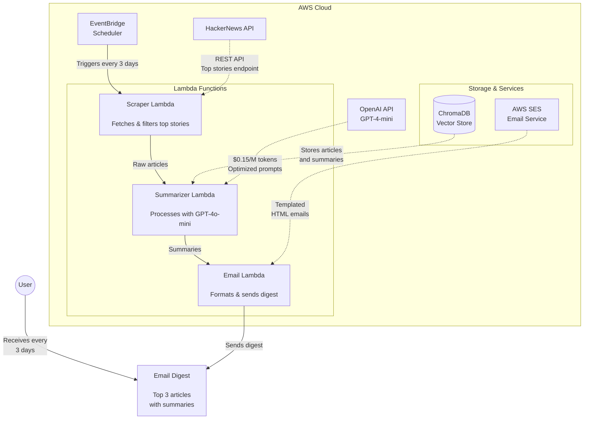

# HackerNews Bot Architecture

## System Overview

The HackerNews Bot is an automated system that fetches, summarizes, and delivers top HackerNews articles to users via email. The system is built on AWS serverless architecture for scalability and cost-effectiveness.

## Architecture Diagram

## Component Breakdown

### 1. AWS EventBridge
- Schedules the article fetching process every 3 days
- Triggers the Scraper Lambda function with precise timing
- Ensures consistent delivery schedule

### 2. Lambda Functions

#### Scraper Lambda
- Fetches top stories from HackerNews API
- Filters stories based on relevance and popularity
- Passes raw article data to the Summarizer Lambda
- Error handling for API failures

#### Summarizer Lambda
- Processes articles using GPT-4-mini
- Generates concise, informative summaries
- Stores results in ChromaDB
- Cost-optimized prompt engineering

#### Email Lambda
- Retrieves latest summaries from ChromaDB
- Formats email digest with HTML template
- Sends emails via AWS SES
- Handles delivery tracking

### 3. Storage & External Services

#### ChromaDB
- Vector database for article storage
- Maintains article metadata and summaries
- Enables efficient retrieval of recent articles
- Persistent storage with backup capability

#### AWS SES (Simple Email Service)
- Handles email delivery
- Manages bounce and complaint handling
- Tracks delivery statistics
- HTML email template support

#### OpenAI API (GPT-4-mini)
- Cost-effective summarization ($0.15/M tokens)
- Optimized for article summary generation
- Backup model configuration for reliability

## Cost Analysis

### API Costs
- GPT-4-mini: $0.15 per million input tokens
  - Estimated monthly cost: ~$0.30 (assuming 3 articles every 3 days)
- AWS Lambda: Free tier eligible
- AWS SES: $0.10 per 1000 emails
- ChromaDB: Self-hosted on EC2 (t3.micro ~$8/month)

### Optimization Strategies
1. Token usage optimization in prompts
2. Caching of repeated requests
3. Batch processing for cost efficiency